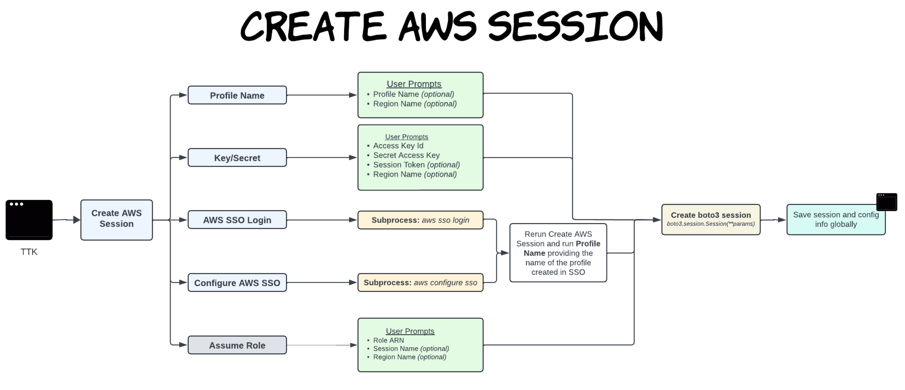
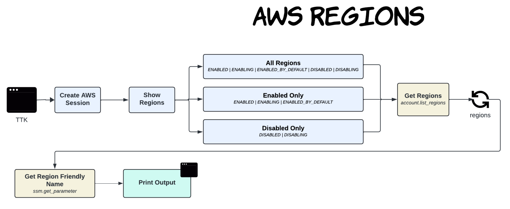
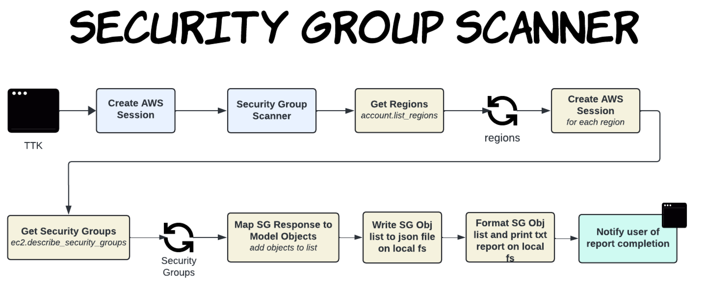
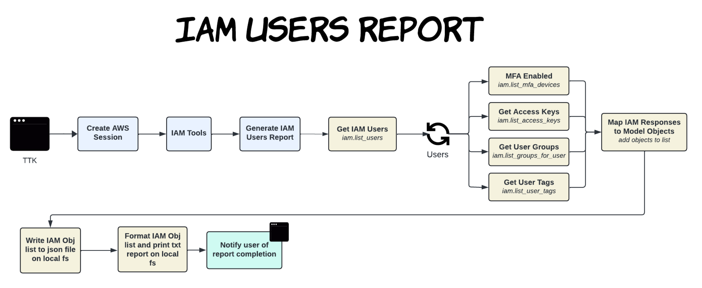
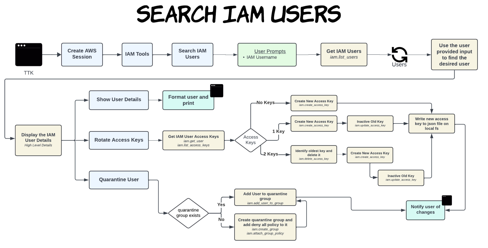
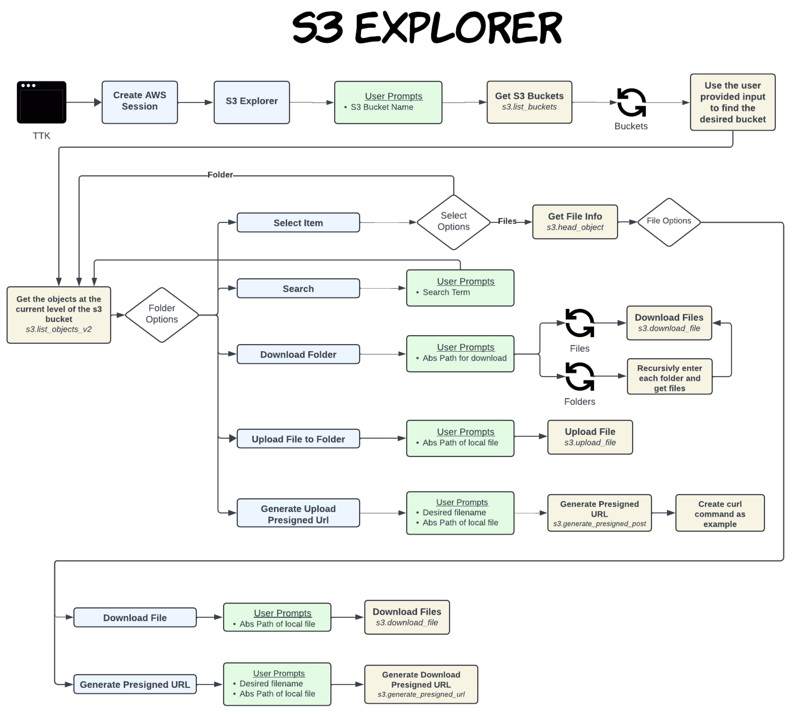

# AWS Tinkerer's Toolkit

---

AWS Tinkerer's Toolkit is a versatile and customizable Command Line Interface (CLI) tool designed for developers, DevOps
engineers, and AWS enthusiasts. This toolkit empowers users to create, manage, and run their custom Python tools with
ease, enabling them to streamline their workflows and address their unique requirements on AWS.

### Key Features

- **Custom Tool Creation**: Write your own Python scripts to perform specific tasks that matter most to you.
- **Ease of Use**: Run your custom tools seamlessly from the command line with minimal setup.
- **Modular Design**: Organize and manage your tools in a modular fashion, allowing for easy maintenance and updates.
- **AWS Integration**: Leverage the power of AWS services directly within your custom tools, enhancing your cloud
  operations and automations.
- **Extensible Framework**: Extend the toolkit’s functionality by adding new tools as your needs evolve.

### Why Use AWS Tinkerer's Toolkit?

The AWS Tinkerer's Toolkit is designed for flexibility and simplicity. Whether you're an experienced developer or a
newcomer to AWS, this toolkit provides the tools you need to customize your cloud environment and automate your
workflows, saving you time and enhancing your productivity.

## Getting Started

---

### Pre-requisites

- Valid AWS Account(s) - [AWS](https://aws.amazon.com/)
- AWS CLI v2 - [AWS CLI](https://docs.aws.amazon.com/cli/latest/userguide/getting-started-install.html)
- Python 3.12 or later - [Python 3.12](https://www.python.org/downloads/release/python-3120/)

### Installation

1. Clone the repository to your machine
2. Create a virtual environment: `python3 -m venv venv`
3. Activate the virtual environment: `source venv/bin/activate`
4. Install the requirements: `pip install -r requirements.txt`

### Running the Application

1. Open your terminal
2. Navigate to the project directory
3. Run the following command: `python3 tkk.py`

# Using the Application

---

## Common Functions

- `build_header`
    - The build_header function generates a formatted header for the application, displaying the application name and
      appropriately sized border lines.

- `build_menu`
    - The build_menu function is designed to create a CLI menu interface for the application. This function constructs
      and displays a structured menu with various components, providing users with clear and organized navigation
      options.

- `create_menu`
    - The create_menu function builds on the build_menu method to create an interactive CLI menu interface. It not only
      constructs and displays the menu but also incorporates user input collection and validation, ensuring a smooth and
      user-friendly experience.

- `form_builder`
    - The form_builder function is designed to create an interactive CLI form interface for collecting user information.
      It utilizes the build_header method to display a form header and guides users through a series of prompts to
      gather necessary details. Once the required information is collected, the results are returned to the calling
      function.

- `search_builder`
    - The search_builder function is designed to create an interactive search form within the CLI, facilitating user
      input for searching. It handles paging through search results, manages user selections, and ensures the validity
      of
      search inputs.

## Features

---

# Create AWS Session

The Create AWS functionality simplifies the creation of AWS boto3 sessions by allowing users to configure their
connection settings flexibly. Users can specify the AWS region, profile name, and access keys, with an optional Security
Token Service (STS) session key for enhanced security and temporary credentials.

# Show Regions

The Show Regions functionality allows for users to easily list out all AWS regions with their long/friendly names.
There are options to show all regions, show only the regions that are enabled, or show only the regions that are
disabled.

# Security Group Scanner

The Security Group Scanner is a powerful feature designed to enhance your AWS security management. It scans all AWS
regions within your account, inspecting each security group per region. The results are parsed and compiled into a
comprehensive and easy-to-read report, both in text and JSON formats.

# IAM User Report

The IAM User Report feature provides a detailed audit of all IAM users within your AWS account. It generates a
comprehensive text report and a JSON file, capturing detailed information about each IAM user.

# IAM Key Rotator

The IAM Key Rotator within the AWS Tinkerer's Toolkit (TTK) integrates seamlessly with the IAM User Search feature,
enabling TTK users to efficiently manage access keys for IAM users. Users can search for an IAM user, retrieve their
details, and optionally move them to a quarantine IAM group to restrict access. Depending on the user's existing keys,
the tool automates key rotation: creating a new key if none exists, generating a new key and deactivating the current
one if only one key exists, or replacing the oldest key, deactivating the remaining key, and creating a new active key
if two keys are present. After each key rotation, the new access key and secret access key are securely stored as a JSON
file on the TTK user's local file system, ensuring ease of access and future reference.

# S3 Explorer

The S3 Explorer in the AWS Tinkerer's Toolkit (TTK) empowers users to interact seamlessly with AWS S3 buckets and their
contents. Users can search for AWS buckets, navigate through folder structures within selected buckets, and locate
specific files for download. The feature supports downloading individual files, as well as entire folders for efficient
data retrieval. Users can upload files directly to specified folders within the bucket and generate pre-signed URLs for
secure upload and download operations. This tool enhances user productivity by facilitating intuitive file management
and secure data transfer capabilities within AWS S3.

## License

This application is licensed under an MIT License. See
the [License](https://github.com/ssailor/aws-tinkerer-toolkit/blob/main/LICENSE) file for details.